# miningos-wrk-ork

## Table of Contents

1. [Overview](#overview)
2. [Architecture](#architecture)
3. [Dependencies](#dependencies)
4. [Configuration](#configuration)
5. [RPC API Reference](#rpc-api-reference)
6. [Data Aggregation System](#data-aggregation-system)
7. [Action Management System](#action-management-system)
8. [Deployment](#deployment)
9. [Development](#development)

---

## Overview

### Purpose

`miningos-wrk-ork` (Orchestrator Worker) is the **centralized coordination and aggregation layer** for the MiningOS. It serves as the controller that:

- **Manages distributed worker registration** ("racks") via Hyperswarm P2P RPC
- **Aggregates operational data** from miners, containers, sensors, powermeters, and mining pools
- **Coordinates write operations** through a multi-voter approval system
- **Provides unified query interface** for the entire mining operation
- **Stores historical time-series data** with timezone-aware aggregation

### Position in Ecosystem

```
┌─────────────────────────────────────────────────────┐
│              miningos-wrk-ork (Orchestrator)           │
│  • Unified RPC interface                            │
│  • Action approval & voting                         │
│  • Cross-rack data aggregation                      │
└──────────────────┬──────────────────────────────────┘
                   │
        ┌──────────┼──────────┐
        │          │          │
        ▼          ▼          ▼
   ┌────────┐ ┌────────┐ ┌────────┐
   │ Rack 1 │ │ Rack 2 │ │ Rack N │  (Registered Workers)
   │ miner  │ │contain-│ │sensor  │
   │ worker │ │  er    │ │ worker │
   └────────┘ └────────┘ └────────┘
        │          │          │
        ▼          ▼          ▼
   [Hardware] [Hardware] [Hardware]
```

**Key Concepts:**
- **Rack**: A registered worker instance managing a specific type of device (miners, containers, sensors, etc.)
- **Thing**: An individual device or service managed by a rack
- **Action**: A write operation requiring approval votes before execution
- **Aggregation**: Consolidation of metrics across racks with statistical operations

---

## Architecture

### Class Hierarchy

```mermaid
---
title: Object Model of MiningOS including orchestrator
---
flowchart RL
    bfx-wrk-base@{ shape: stadium, label: "*bfx-wrk-base*" }

    tether-wrk-base@{ shape: stadium, label: "*tether-wrk-base*" }
    tether-wrk-base--->bfx-wrk-base

    miningos-wrk-ork@{ label: "*miningos-wrk-ork*" }
    miningos-wrk-ork--->tether-wrk-base


    style miningos-wrk-ork fill:#005,stroke-width:4px
```



### Core Components

#### 1. Rack Registry
- **Storage**: Hyperbee database (`racks`)
- **Purpose**: Maintains registered worker instances with RPC public keys
- **Operations**: Register, list, forget racks by type

#### 2. Action Approval System
- **Facility**: `svc-facs-action-approver`
- **Storage**: Hyperbee database (`action-approver`)
- **States**: `voting` → `ready` → `executing` → `done`
- **Voting**: Configurable positive/negative vote thresholds

#### 3. Aggregation Engine
- **Library**: `miningos-lib-stats`
- **Storage**: Hyperbee database (`tail-log-aggr`)
- **Operations**: sum, avg, obj_concat, arr_concat, alerts_aggr
- **Time Ranges**: Configurable intervals with timezone support

### Data Flow

```
Rack Workers → RPC → Orchestrator → Aggregation → Storage
                         ↓
                  Query Interface
                         ↓
                    API Consumers
```

---


## RPC API Reference

### Inherited Methods (from `tether-wrk-base`)

| Method | Operation | Description |
|--------|-----------|-------------|
| `ping` | Read | Echo test (returns input) |
| `getInstanceId` | Read | Returns worker instance UUID |

### Rack Management

#### `registerRack`

Register a new worker instance.

**Operation:** Write

**Request:**
```json
{
  "id": "miner-wm-m56s-shard-0",
  "type": "miner",
  "info": {
    "rpcPublicKey": "64-char-hex-public-key"
  }
}
```

**Response:** `1` (success)

**Errors:**
- `ERR_RACK_ID_INVALID`
- `ERR_RACK_TYPE_INVALID`
- `ERR_RACK_INFO_RPC_PUBKEY_INVALID`

**Example:**
```bash
hp-rpc-cli -s wrk-st-0 -m registerRack -d '{
  "id": "miner-wm-m56s-shard-0",
  "type": "miner",
  "info": {"rpcPublicKey": "abc123..."}
}'
```

#### `listRacks`

List registered racks.

**Operation:** Read

**Request:**
```json
{
  "type": "miner",  // optional: filter by type prefix
  "keys": 1         // optional: include RPC keys (default: hidden)
}
```

**Response:**
```json
[
  {
    "id": "miner-wm-m56s-shard-0",
    "type": "miner",
    "info": {
      "rpcPublicKey": "..."  // only if keys=1
    }
  }
]
```

**Errors:**
- `ERR_TYPE_INVALID`

**Example:**
```bash
hp-rpc-cli -s wrk-st-0 -m listRacks -d '{"keys":1}'
```

#### `forgetRacks`

Remove registered racks.

**Operation:** Write

**Request:**
```json
{
  "ids": ["rack-id-1", "rack-id-2"],  // specific racks
  "all": true                          // or all racks
}
```

**Response:** Number of racks removed

### Thing Management

#### `listThings`

Query devices across all racks.

**Operation:** Read

**Request:**
```json
{
  "query": {                    // MongoDB-style query
    "last.snap.stats.status": {"$eq": "online"},
    "tags": {"$in": ["t-miner"]}
  },
  "fields": {                   // Projection
    "id": 1,
    "last.snap.stats.hashrate": 1
  },
  "sort": {                     // Sort order
    "last.snap.stats.hashrate": -1
  },
  "limit": 100
}
```

**Response:**
```json
[
  {
    "id": "miner-001",
    "last": {
      "snap": {
        "stats": {
          "hashrate": 125000000
        }
      }
    }
  }
]
```

**Notes:**
- Aggregates results from all registered racks
- Supports full MongoDB query syntax via `mingo`
- Parallel queries with limit of 25 concurrent rack requests

#### `forgetThings`

Remove devices from racks.

**Operation:** Write

**Request:**
```json
{
  "ids": ["thing-id-1", "thing-id-2"],
  "all": true  // optional: forget all things
}
```

**Response:** Number of things removed across all racks

### Historical Data

#### `getHistoricalLogs`

Retrieve historical log entries.

**Operation:** Read

**Request:**
```json
{
  "logType": "error",           // log type to retrieve
  "query": {...},               // optional MongoDB query
  "sort": {"ts": -1},          // optional sort
  "limit": 100
}
```

**Response:** Array of log entries from all racks

#### `tailLog`

Query aggregated time-series data.

**Operation:** Read

**Request:**
```json
{
  "type": "miner",              // device type
  "key": "stat-5m",             // data key
  "tag": "t-miner",             // tag filter
  "fields": {                   // source fields
    "hashrate_mhs_1m_sum": 1
  },
  "aggrFields": {               // aggregated fields
    "hashrate_mhs_1m_sum_aggr": 1,
    "ts": 1,
    "aggrTsRange": 1,
    "aggrCount": 1,
    "aggrIntervals": 1
  },
  "start": 1704067200000,       // optional start timestamp
  "end": 1704153600000,         // optional end timestamp
  "limit": 288,                 // max records
  "applyAggrCrossthg": true     // optional: apply cross-thing aggr
}
```

**Response:**
```json
[
  {
    "ts": 1704067200000,
    "hashrate_mhs_1m_sum_aggr": 850000000000,
    "aggrTsRange": "1704067200000-1704070800000",
    "aggrCount": 25,
    "aggrIntervals": 1
  }
]
```

**Errors:**
- `ERR_NOT_CONFIGURED`
- `ERR_TYPE_INVALID`
- `ERR_TYPE_AGGR_INVALID`

**Notes:**
- Automatically adds `ts`, `aggrTsRange`, `aggrCount`, `aggrIntervals` to aggregated fields
- Operations defined in `aggr.stats.json`
- Supports custom time ranges with `start`/`end`

#### `tailLogMulti`

Query multiple aggregation types in parallel.

**Operation:** Read

**Request:**
```json
{
  "keys": [
    {"type": "miner", "key": "stat-5m", "tag": "t-miner"},
    {"type": "container", "key": "stat-5m", "tag": "t-container"}
  ],
  "fields": {...},              // applied to all
  "aggrFields": {...}           // applied to all
}
```

**Response:** Array of results (one per key)

**Notes:**
- Parallel execution with limit of 5 concurrent queries
- Each query must have `type` specified

#### `tailLogCustomRangeAggr`

Retrieve pre-aggregated daily data within a date range.

**Operation:** Read

**Request:**
```json
{
  "keys": [
    {
      "type": "miner",
      "startDate": "2024-01-01",
      "endDate": "2024-01-31",
      "timezoneOffset": 0,          // milliseconds
      "fields": {
        "hashrate_mhs_5m_avg_aggr": 1
      },
      "shouldReturnDailyData": false  // true: daily array, false: range aggr
    }
  ]
}
```

**Response:**
```json
[
  {
    "type": "miner",
    "data": {
      "hashrate_mhs_5m_avg_aggr": 123456789,
      "aggrCount": 8640,              // total snapshots
      "aggrIntervals": 8640           // total intervals
    },
    "error": null
  }
]
```

**With `shouldReturnDailyData: true`:**
```json
[
  {
    "type": "miner",
    "data": [
      {"ts": 1704067200000, "val": {...}},
      {"ts": 1704153600000, "val": {...}}
    ],
    "error": null
  }
]
```

**Notes:**
- Uses pre-stored daily aggregations from `tail-log-aggr` database
- Requires `global.config.json` with timezone definitions
- Timezone offset in milliseconds (e.g., UTC-3 = -10800000)

### Thing Comments

#### `saveThingComment`

Add a comment to a thing.

**Operation:** Write

**Request:**
```json
{
  "rackId": "miner-rack-0",
  "thingId": "miner-001",
  "comment": "Replaced heat sink",
  "user": "technician@example.com"
}
```

**Response:** `1` (success) or `0` (failure)

#### `editThingComment`

Edit an existing comment.

**Operation:** Write

**Request:**
```json
{
  "rackId": "miner-rack-0",
  "thingId": "miner-001",
  "commentId": "comment-uuid",
  "comment": "Updated comment text"
}
```

**Response:** `1` (success) or `0` (failure)

#### `deleteThingComment`

Delete a comment.

**Operation:** Write

**Request:**
```json
{
  "rackId": "miner-rack-0",
  "thingId": "miner-001",
  "commentId": "comment-uuid"
}
```

**Response:** `1` (success) or `0` (failure)

### Action Management

#### `pushAction`

Submit an action for approval.

**Operation:** Write

**Request:**
```json
{
  "query": {                        // Target selection
    "tags": {"$in": ["t-miner"]},
    "last.snap.stats.status": {"$eq": "online"}
  },
  "action": "reboot",               // Action name
  "params": [],                     // Action parameters
  "voter": "admin@example.com",     // Initial voter
  "authPerms": ["miner:rw"]         // Required permissions
}
```

**Response:**
```json
{
  "id": 1692277886841,              // Action ID (null if failed)
  "data": {                         // Full action object (when successful)
    "id": 1692277886841,
    "action": "reboot",
    "params": [...],
    "targets": {...},
    "requiredPerms": ["miner"],
    "votes": {...},
    "state": "voting"
  },
  "errors": []                      // Array of error messages
}
```

**Errors (Thrown - stop execution):**

| Error | Condition |
|-------|-----------|
| `ERR_QUERY_INVALID` | Query is not a plain object or contains invalid MongoDB syntax |
| `ERR_ACTION_INVALID` | Action is not a string or is empty |
| `ERR_PARAMS_INVALID` | Params is not an array |
| `ERR_ACTION_INVALID_MISSING_RACKID` | Rack actions (`registerThing`, `updateThing`, `forgetThings`) missing `rackId` in params[0] |
| `ERR_ACTION_INVALID_MISSING_ID` | `updateThing` action missing `id` in params[0] |
| `ERR_ACTION_INVALID_QUERY_ID` | `forgetThings` action has non-string `query.id` in params[0] |

**Errors (Returned - action partially succeeds):**

| Error | Condition |
|-------|-----------|
| `ERR_ORK_ACTION_CALLS_EMPTY` | No targets found matching query and permissions |
| Rack-specific errors | Individual rack RPC failures (timeout, connection refused, etc.) |

**Notes:**
- When `ERR_ORK_ACTION_CALLS_EMPTY` occurs, `id` is `null` and no action is created
- Rack-level errors are non-fatal: action proceeds if at least one rack succeeds
- All racks are queried in parallel with limit of 5 concurrent requests
- Rack RPC timeout: 120 seconds

#### `pushActionsBatch`

Submit multiple actions as a batch.

**Operation:** Write

**Request:**
```json
{
  "batchActionsPayload": [
    {
      "query": {...},
      "action": "reboot",
      "params": []
    },
    {
      "query": {...},
      "action": "setPowerMode",
      "params": ["sleep"]
    }
  ],
  "voter": "admin@example.com",
  "authPerms": ["miner:rw"],
  "batchActionUID": "maintenance-001"  // optional identifier
}
```

**Response:** Array of action IDs and data (one per batch item)

**Errors:**

- `ERR_PAYLOAD_INVALID`

**Notes:**
- Executes up to 5 actions in parallel
- Each action gets timestamp-prefixed UID: `{timestamp}-{batchActionUID}`

#### `voteAction`

Cast a vote on a pending action.

**Operation:** Write

**Request:**
```json
{
  "id": 1692277886841,
  "voter": "supervisor@example.com",
  "approve": true,                   // true=approve, false=deny
  "authPerms": ["miner:rw"]
}
```

**Response:** `1` (success)

**Errors:**
- `ERR_ACTION_DENIED` (insufficient permissions)

**Example:**
```bash
hp-rpc-cli -s wrk-st-0 -m voteAction -d '{
  "id": 1692890293574,
  "voter": "supervisor@example.com",
  "approve": true,
  "authPerms": ["miner", "container"]
}'
```

#### `getAction`

Retrieve a specific action.

**Operation:** Read

**Request:**
```json
{
  "id": 1692277886841,
  "type": "voting"                   // voting/ready/executing/done
}
```

**Response:**
```json
{
  "id": 1692277886841,
  "action": "reboot",
  "params": [],
  "targets": {...},
  "requiredPerms": ["miner"],
  "votes": {
    "admin@example.com": true,
    "supervisor@example.com": true
  },
  "reqVotesPos": 2,
  "reqVotesNeg": 1,
  "state": "ready"
}
```

#### `getActionsBatch`

Retrieve multiple actions by IDs.

**Operation:** Read

**Request:**
```json
{
  "ids": [1692277886841, 1692277999999]
}
```

**Response:**
```json
[
  {
    "type": "done",
    "action": {...}
  },
  {
    "type": "voting",
    "action": {...}
  }
]
```

**Notes:**
- Searches all state databases (voting, ready, executing, done)
- Returns `null` for IDs not found

#### `queryActions`

Query actions with filters.

**Operation:** Read

**Request:**
```json
{
  "queries": [
    {
      "type": "voting",              // required
      "filter": {                    // timestamp range
        "gte": 1692277886841,
        "lte": 1692364286841
      },
      "opts": {
        "limit": 100
      },
      "query": {                     // optional MongoDB query
        "action": {"$eq": "reboot"}
      },
      "fields": {                    // optional projection
        "id": 1,
        "action": 1
      }
    }
  ],
  "groupBatch": false                // true: group by batchActionUID
}
```

**Response:**
```json
{
  "voting": [
    {
      "id": 1692277886841,
      "action": "reboot",
      "targets": {...},
      "votes": {...}
    }
  ]
}
```

**With `groupBatch: true`:**
```json
{
  "voting": [
    {
      "batchActionUID": "1692277886841-maintenance-001",
      "id": "1692277886841",
      "actions": [
        {...},
        {...}
      ]
    }
  ]
}
```

**Filter Options:**
- `gt`: Greater than timestamp
- `gte`: Greater than or equal
- `lt`: Less than timestamp
- `lte`: Less than or equal

#### `cancelActionsBatch`

Cancel multiple actions.

**Operation:** Write

**Request:**
```json
{
  "ids": [1692277886841, 1692277999999],
  "voter": "admin@example.com"
}
```

**Response:** Number of actions cancelled

### Configuration

#### `getGlobalConfig`

Retrieve global site configuration.

**Operation:** Read

**Request:**
```json
{
  "fields": {                        // optional projection
    "nominalSiteHashrate_MHS": 1,
    "isAutoSleepAllowed": 1
  }
}
```

**Response:**
```json
{
  "nominalSiteHashrate_MHS": 709032000000,
  "isAutoSleepAllowed": false
}
```

#### `setGlobalConfig`

Update global site configuration.

**Operation:** Write

**Request:**
```json
{
  "isAutoSleepAllowed": true
}
```

**Response:** Updated global config object or `null`

**Notes:**
- Currently only supports updating `isAutoSleepAllowed`
- Modifies in-memory configuration (not persisted to file)

#### `getWrkConf`

Retrieve worker configuration from racks.

**Operation:** Read

**Request:**
```json
{
  "type": "miner"                    // device type
}
```

**Response:**
```json
[
  {
    "rackId": "miner-rack-0",
    "config": {...}                  // rack-specific config
  }
]
```

#### `getThingConf`

Retrieve thing configuration from racks.

**Operation:** Read

**Request:**
```json
{
  "type": "miner"
}
```

**Response:**
```json
[
  {
    "rackId": "miner-rack-0",
    "requestValue": {...}            // thing-specific config
  }
]
```

#### `getWrkSettings`

Retrieve worker settings from specific rack.

**Operation:** Read

**Request:**
```json
{
  "rackId": "miner-rack-0"
}
```

**Response:** Worker settings object

**Errors:**
- `ERR_RACK_ID_INVALID`
- `ERR_GET_SETTINGS_FAILED`

#### `saveWrkSettings`

Save worker settings to specific rack.

**Operation:** Write

**Request:**
```json
{
  "rackId": "miner-rack-0",
  "entries": {
    "key1": "value1",
    "key2": "value2"
  }
}
```

**Response:** `1` (success)

**Errors:**
- `ERR_RACK_ID_INVALID`
- `ERR_ENTRIES_INVALID`
- `ERR_SAVE_SETTINGS_FAILED`


## Data Aggregation System

### Overview

The orchestrator aggregates data from distributed racks using a two-tier system:

1. **Real-time Aggregation** (`tailLog`): On-demand aggregation of current data
2. **Historical Storage** (`tail-log-aggr` DB): Pre-computed daily aggregations


### Time-Series Data Flow

```
1. Racks collect device snapshots (5m intervals)
       ↓
2. Orchestrator queries racks via tailLog RPC
       ↓
3. Apply aggregation operations (sum/avg/concat)
       ↓
4. Return consolidated metrics
       ↓
5. Background: Store daily aggregates to DB
       ↓
6. API: Query historical ranges via tailLogCustomRangeAggr
```

## Action Management System

### Action Lifecycle

```
1. SUBMISSION
   User/API calls pushAction
   → Query resolves to target things
   → Create action with reqVotesPos/reqVotesNeg
   → State: "voting"

2. VOTING
   Users call voteAction
   → Permissions checked against requiredPerms
   → Vote recorded
   → If threshold met → State: "ready"
   → If denied → State: "cancelled"

3. EXECUTION
   Background worker (actionIntvlMs interval)
   → Picks up "ready" actions
   → State: "executing"
   → Calls action on all targets via ActionCaller
   → Records results/errors per target

4. COMPLETION
   → State: "done"
   → Results available via getAction/queryActions
```

### Permission System

**Format:** `{type}:{level}`

**Levels:**
- `r`: Read-only
- `w`: Write-only
- `rw`: Read-write

**Examples:**
- `miner:rw`: Full access to miner actions
- `container:r`: Read-only container access
- `miner:w`: Write-only miner access (can execute actions, not query)

**Permission Checking:**
```javascript
// User has ["miner:rw", "container:r"]
// Action requires ["miner"]
hasPermission(["miner:rw", "container:r"], "miner:w") // true
hasPermission(["miner:rw", "container:r"], "container:w") // false
```

### Vote Requirements

**Configuration:**
```javascript
{
  reqVotesPos: 2,  // Requires 2 positive votes to approve
  reqVotesNeg: 1   // 1 negative vote cancels action
}
```

**Logic:**
- Positive votes accumulate until `reqVotesPos` reached → action ready
- Any negative vote → action cancelled
- Racks can specify different vote requirements (highest used)

### Batch Actions

**Features:**
- Submit multiple actions with shared UID
- Query/display actions as grouped batch
- Cancel entire batch with one call

**Batch UID Format:** `{timestamp}-{user-provided-id}`

**Query Grouping:**
```javascript
queryActions({
  queries: [{type: "done", ...}],
  groupBatch: true  // Groups actions by batchActionUID
})
```

### Action Caller System

**Class:** `ActionCaller` (proxied for dynamic action methods)

**Process:**
1. `getWriteCalls(query, action, params, permissions)`
   - Queries all racks for matching targets
   - Checks user permissions
   - Returns `{targets, requiredPerms}`

2. `callTargets(action, params, targets)`
   - Executes action on all target things
   - Parallel execution (limit: `callTargetsLimit` from config)
   - Records `result` or `error` per target call

**Rack Actions:**
Special actions that operate on rack level (not individual things):
- `registerThing`
- `updateThing`
- `forgetThings`
- `rackReboot`

## Deployment

### Requirements

- Node.js >= 20.0

### Installation

```bash
# Clone repository
git clone https://github.com/tetherto/miningos-wrk-ork.git
cd miningos-wrk-ork

# Install dependencies
npm install

# Setup configuration files
./setup-config.sh

```

### Configuration Steps

1. **Network Configuration** (`config/facs/net.config.json`)
   - Add allowed RPC public keys to `allow` array
   - Add read-only keys to `allowReadOnly` array
   - Set `allowLocal: true` for access from same server

2. **Orchestrator Settings** (`config/base.ork.json`)
   - Adjust `actionIntvlMs` for action processing speed
   - Set `callTargetsLimit` based on infrastructure size
   - Configure `automationTypes` for automated actions

3. **Global Configuration** (`config/global.config.json`)
   - Define timezones for your operation
   - Set nominal site hashrate and capacity
   - Configure power consumption thresholds
   - Enable/disable auto-sleep: `isAutoSleepAllowed`

### Running the Worker

```bash
# Development
DEBUG="*" node worker.js --wtype wrk-ork-proc-aggr --env development --cluster shard-1

# Production
node worker.js --wtype wrk-ork-proc-aggr --env production --cluster shard-1
```

**Required Arguments:**
- `--wtype`: Worker type (must be `wrk-ork-proc-aggr`)
- `--env`: Environment (development/production)
- `--cluster`: Cluster identifier (e.g., `shard-1`)

**Notes:**
- Each orchestrator instance manages its own cluster of racks
- Use `--cluster` to identify different shards
- Racks register to specific orchestrator via RPC public key

### Status Files

Worker status saved to: `status/wrk-ork-proc-aggr-{cluster}.json`

```json
{
  "instanceId": "wrk-ork-proc-aggr-shard-1-uuid",
  "rpcPublicKey": "64-char-hex",
  "rpcClientKey": "64-char-hex"
}
```

### Database Storage

Hyperbee databases created in: `store/{cluster}-db/`

| Database | Purpose |
|----------|---------|
| `racks` | Registered rack registry |
| `action-approver` | Action states (voting/ready/executing/done) |
| `tail-log-aggr` | Historical daily aggregations |

---

## Development

### Testing

```bash
# Run tests
npm test

# Lint code
npm run lint

# Fix linting issues
npm run lint:fix
```

### Debugging

**Enable debug output:**
```bash
DEBUG="ork:*" node worker.js --wtype wrk-ork-proc-aggr --env development --cluster shard-1
```

**Debug specific methods:**
```javascript
this.debugGeneric('method name', data)  // General logging
this.debugError('error context', error, true)  // Error with alert
```

**Check worker status:**
```bash
cat status/wrk-ork-proc-aggr-shard-1.json
```
---

## Appendix

### Error Codes Reference

| Error | Meaning |
|-------|---------|
| `ERR_PROC_RACK_UNDEFINED` | Cluster argument missing |
| `ERR_RACK_ID_INVALID` | Invalid or missing rack ID |
| `ERR_RACK_TYPE_INVALID` | Invalid or missing rack type |
| `ERR_RACK_INFO_RPC_PUBKEY_INVALID` | Missing RPC public key |
| `ERR_TYPE_INVALID` | Invalid or missing device type |
| `ERR_LOG_TYPE_INVALID` | Invalid log type |
| `ERR_QUERY_INVALID` | Invalid MongoDB query |
| `ERR_ACTION_INVALID` | Invalid action name |
| `ERR_PARAMS_INVALID` | Invalid action parameters |
| `ERR_KEYS_INVALID` | Invalid keys array |
| `ERR_TYPE_AGGR_INVALID` | Aggregation not configured for type |
| `ERR_START_DATE_INVALID` | Invalid start date format |
| `ERR_END_DATE_INVALID` | Invalid end date format |
| `ERR_TIMEZONE_OFFSET_INVALID` | Timezone not configured |
| `ERR_NOT_CONFIGURED` | Required config file missing |
| `ERR_TIMEZONES_NOT_CONFIGURED` | Global timezones missing |
| `ERR_GLOBAL_CONFIG_MISSING` | Global config not loaded |
| `ERR_GLOBAL_CONFIG_NOT_FOUND` | Global config not found |
| `ERR_CONFIG_INVALID` | Invalid config parameters |
| `ERR_PAYLOAD_INVALID` | Invalid batch payload |
| `ERR_QUERIES_INVALID` | Invalid queries array |
| `ERR_QUERIES_TYPE_INVALID` | Query missing type |
| `ERR_ORK_ACTION_CALLS_EMPTY` | No targets matched query |
| `ERR_ACTION_DENIED` | Insufficient permissions |
| `ERR_ACTION_INVALID_MISSING_RACKID` | Rack action missing rackId |
| `ERR_ACTION_INVALID_MISSING_ID` | Update action missing ID |
| `ERR_ACTION_INVALID_QUERY_ID` | Forget action missing query.id |
| `ERR_MISSING_WRITE_PERMISSIONS` | Read-only peer attempted write |
| `ERR_NET_INVALID_INSTANCE` | Invalid network facility |
| `ERR_RACKS_INSTANCE_INVALID` | Invalid racks database |
| `ERR_ENTRIES_INVALID` | Settings entries invalid |
| `ERR_GET_SETTINGS_FAILED` | Failed to get settings from rack |
| `ERR_SAVE_SETTINGS_FAILED` | Failed to save settings to rack |


### Timezone Configuration

**Common Timezone Offsets:**

| Timezone | Offset (ms) | UTC Offset |
|----------|-------------|------------|
| UTC | 0 | UTC+0 |
| EST | -18000000 | UTC-5 |
| CST | -21600000 | UTC-6 |
| MST | -25200000 | UTC-7 |
| PST | -28800000 | UTC-8 |
| CET | 3600000 | UTC+1 |
| EET | 7200000 | UTC+2 |
| UYT | -10800000 | UTC-3 |
| JST | 32400000 | UTC+9 |

**Adding Timezone:**
```json
{
  "aggrTailLogTimezones": [
    {
      "code": "PST",
      "offset": -28800000
    }
  ]
}
```

---
